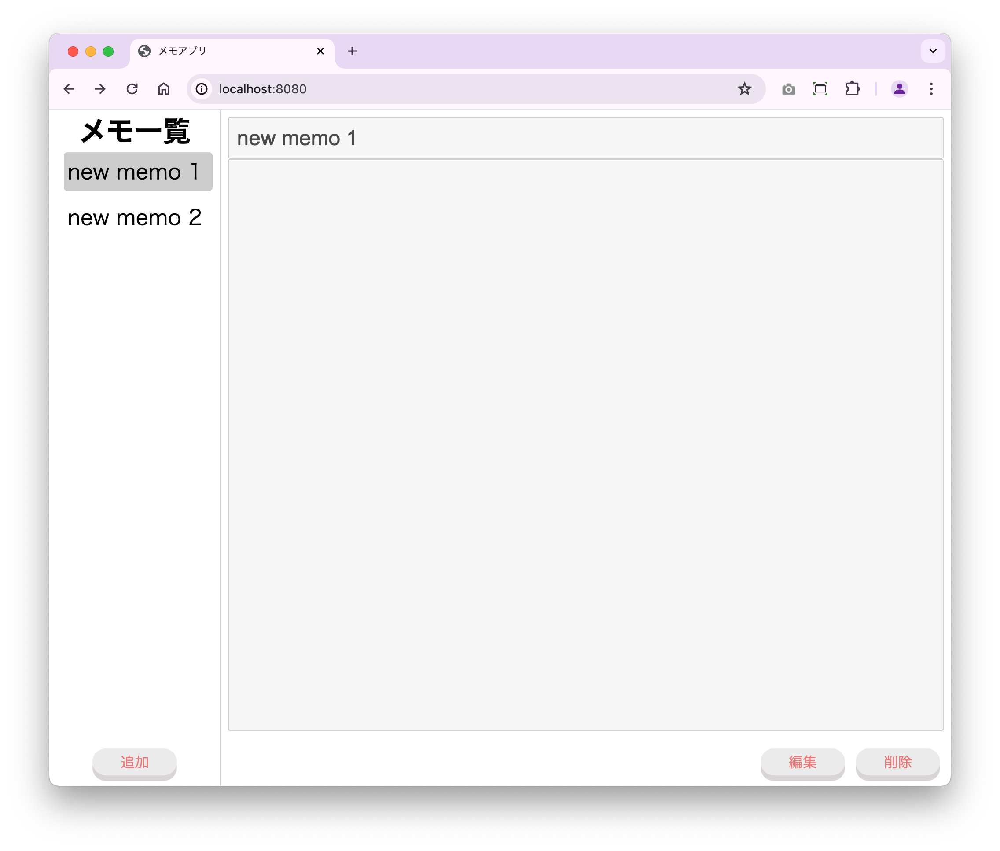
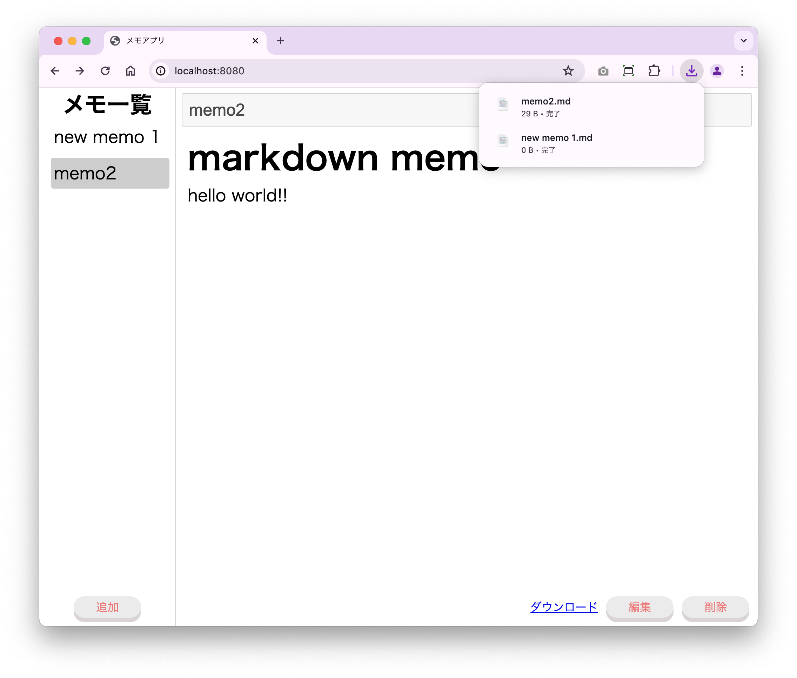

# メモアプリ

TypeScript を使用したメモアプリです。
TypeScript の学習コンテンツで、HTML,CSS,TypeScript(JavaScript)で実装しています。

## v1

### 機能

- メモの追加
- メモの表示
- メモの更新
- メモの削除
- メモの切り替え

### 技術スタック

- TypeScript
- JavaScript
- DOM とイベント
- localStorage

### 画面

## v2

### 機能

- メモの本文のマークダウン記述
- メモのダウンロード

### 技術スタック

- TypeScript
- JavaScript
- DOM とイベント
- localStorage
- marked（Markdown の外部ライブラリ）

### 画面

